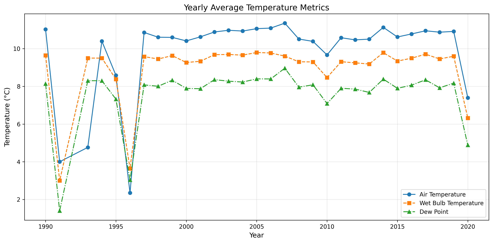
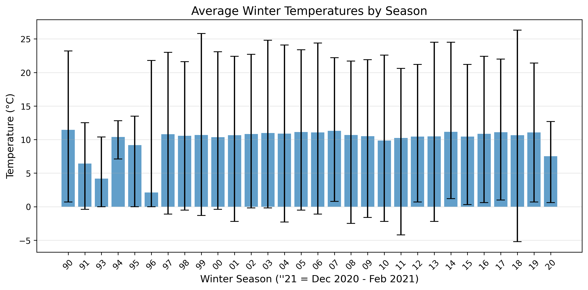
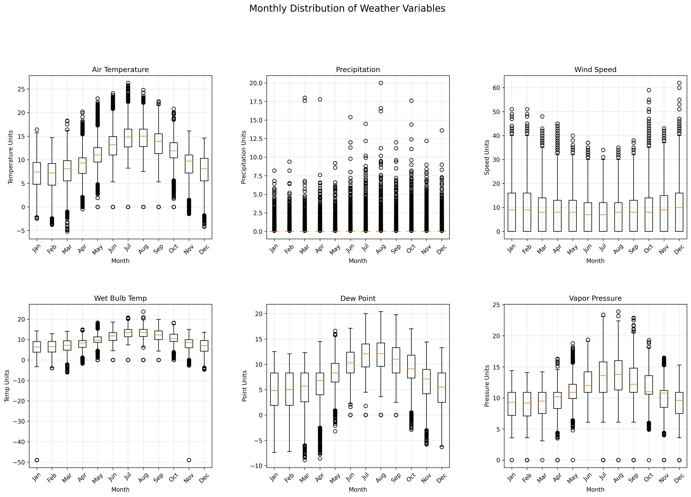

  
<h1 align="center">  

 Big Weather Data Analysis (1990-2020)</h1>  

  
  
  
  
  
  

  

 

## Overview 🌦️
This project analyzes 30 years of meteorological data (1990-2020) containing 245,088 observations across 16 variables. Using Apache Spark in a Colab environment, I performed comprehensive data cleaning, null value imputation, and visualization to reveal long-term weather patterns and trends.

## Dataset Description 
The dataset contains hourly weather measurements with the following schema:

| Column Name             | Data Type | Description                       | Null Count |
|-------------------------|-----------|-----------------------------------|------------|
| _c0                     | Integer   | Index column                      | 0          |
| dateTime                | String    | Timestamp                         | 0          |
| indicator_rain          | Integer   | Precipitation indicator           | 0          |
| precipitation           | String    | Rainfall measurement              | 384        |
| indicator_temp          | Integer   | Temperature indicator             | 0          |
| air_temperature         | String    | Air temperature                   | 18,730     |
| indicator_wetb          | Integer   | Wet bulb indicator                | 0          |
| wetb                    | String    | Wet bulb temperature              | 26,462     |
| dewpt                   | String    | Dew point                         | 26,462     |
| vappr                   | String    | Vapor pressure                    | 49,571     |
| relative_humidity       | String    | Humidity percentage               | 49,560     |
| msl                     | String    | Mean sea level pressure           | 32,814     |
| indicator_wdsp          | Integer   | Wind speed indicator              | 0          |
| wind_speed              | String    | Wind speed                        | 349        |
| indicator_wddir         | Integer   | Wind direction indicator          | 0          |
| wind_from_direction     | Integer   | Wind direction                    | 608        |

**Note:** All string-type columns contain numeric data that was parsed during analysis.

## Data Cleaning Process 🧹

1. **Null Value Analysis**:
   - Identified columns with missing values (e.g., precipitation: 384, air_temperature: 18,730, etc.)
   - Verified no empty strings in the `dateTime` field

2. **Imputation Strategy**:
   - **Median imputation** for: 
     - `['precipitation', 'air_temperature', 'wetb', 'dewpt', 'vappr', 'relative_humidity', 'msl', 'wind_speed']`
   - **Circular-aware imputation** for directional data:
     - `wind_from_direction` (272 remaining nulls after initial imputation)

## Data Visualization 📈

Three key figures were developed to illustrate the insights derived from the dataset:

1. **Figure 1: Average Temperature per Year**
   - **Description:**  
     Visualizes the average temperature for each year from 1990 to 2020.
   - **Key Insights:**  
     - The years **1992** and **1996** recorded the lowest average temperatures.
     - The highest average temperature was observed in **2008**.

  
  
 

  <i>Figure-1:</i> Average Temperature per Year
 

  

2. **Figure 2: Winter Temperature Analysis**
   - **Description:**  
     Combines a blue bar graph showing the average winter temperature with a black line graph indicating the minimum and maximum winter temperatures for each year.
   - **Key Insights:**  
     - **1996** emerges as the coldest winter.
     - **2018** exhibits the highest fluctuation in winter temperatures.

  
  
 

  <i>Figure-2:</i> Winter Temperature Analysis
 

  

3. **Figure 3: Monthly Weather Variable Box Plots**
   - **Description:**  
     Box plots display the distribution (average, minimum, maximum, and quartile values) for key weather variables (air temperature, precipitation, wind speed, wet-bulb temperature, dew point, and vapor pressure) on a monthly basis over the 30-year period.
   - **Key Insights:**  
     - Temperature variables show a steady increase from January to August followed by a gradual decrease.
     - Precipitation remains relatively constant throughout the year.
     - Wind speed notably decreases during August.

  
  
 

  <i>Figure-3:</i> Monthly Weather Variable Box Plots
 

  

## Technologies Used 🛠️
- **Google Colab**: Cloud-based development environment.
- **Apache Spark**: Big data processing framework.
- **Pandas & PySpark**: Data cleaning and transformation.
- **Matplotlib & Seaborn**: Data visualization.

## Significance for Researchers 🎓
This analysis demonstrates:
1. Effective handling of large-scale temporal data (245k+ records)
2. Robust null value treatment in meteorological datasets
3. Visualization techniques for multidimensional weather analysis
4. Climate pattern identification over 30-year periods

## Potential Applications 🌍
- Climate change research
- Agricultural planning
- Energy demand forecasting
- Urban infrastructure development
- Historical weather pattern analysis

For detailed code implementation, please see the accompanying Jupyter notebook.

## Acknowledgments 🙏
This project was completed as part of my research and academic work in big data analysis. Feedback and contributions are welcome!
